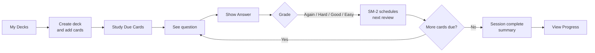
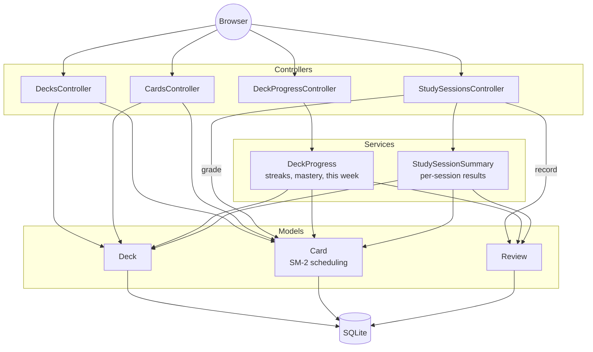
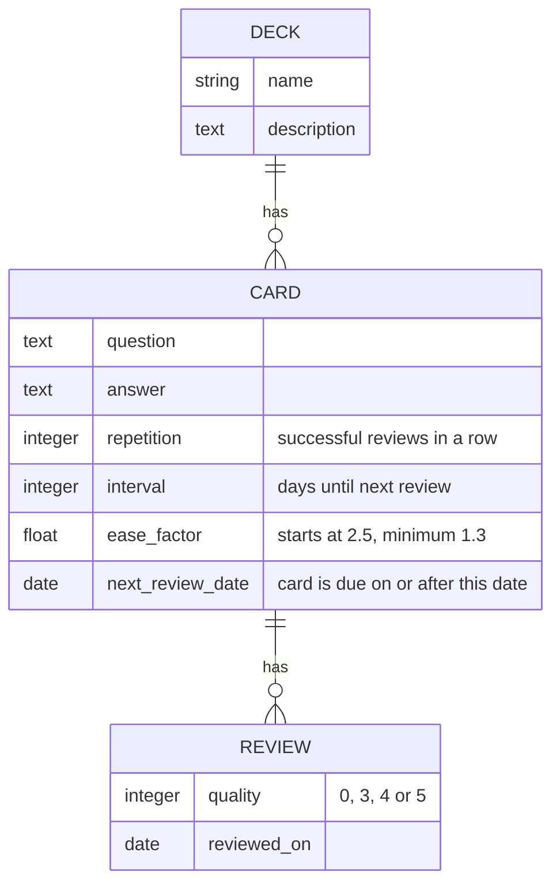
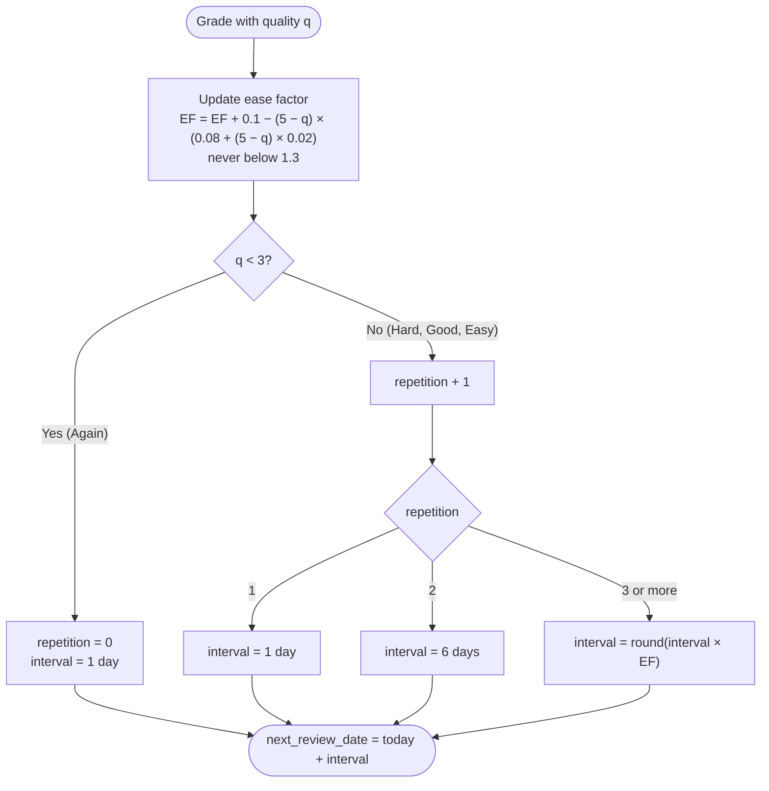
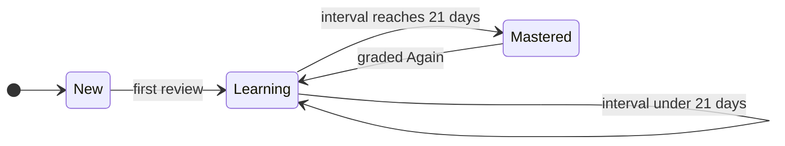

# StudyBuddy

StudyBuddy is a Ruby on Rails flashcard app. Learners organize cards into decks, study the cards that are due, and grade how well they remembered each one. The **SM-2 spaced-repetition algorithm** then decides when each card comes back, and a progress page shows streaks and how close each deck is to being mastered.

**Team:** Tanvi Patel · Ankita Dan

## Features

| Area | What it does |
| --- | --- |
| Decks & cards | Create, view, edit, and delete decks and their cards. Questions and answers are required. |
| Study sessions | Shows only the cards due today or earlier. Reveal the answer, then grade it **Again / Hard / Good / Easy**. |
| SM-2 scheduling | Each grade updates the card's repetitions, interval, ease factor, and next review date. |
| Progress | Per deck: cards due, total reviews, study streak, a streak goal, a New → Learning → Mastered bar, and this week's study days. |
| Session summary | After the last due card: cards reviewed, % remembered, streak, and rating breakdown. |
| CSV | Export a deck's cards (`GET /decks/:deck_id/cards/export`) and import a deck (`POST /decks/import`). These are endpoints only; no page links to them yet. |

**Tech stack:** Ruby 3.3 · Rails 8.1 · SQLite · ERB + CSS (no JavaScript) · RSpec · RuboCop

## Getting started

```bash
git clone https://github.com/ankitadan/study-buddy.git
cd study-buddy
bundle install
bin/rails db:setup
bin/rails server
```

Open **http://localhost:3000/decks**. There is no home page at `/`.

## How a learner uses it



## Architecture

StudyBuddy uses standard Rails MVC. Progress calculations live in plain Ruby service objects so controllers stay thin and the rules are easy to unit test.



### Data model



A card holds its **current** schedule. A review is the **history**: one row each time a card is graded. Progress and streaks are calculated from reviews. Deleting a deck deletes its cards, and deleting a card deletes its reviews.

### Routes

| Route | Purpose |
| --- | --- |
| `/decks` | All decks with due, reviews, and streak |
| `/decks/:id` | One deck, browsing its cards one at a time |
| `/decks/:deck_id/cards` | Card management for a deck |
| `/decks/:deck_id/study_session` | Study the due cards (`POST .../review` grades one) |
| `/decks/:deck_id/progress` | Progress page for a deck |

## SM-2 algorithm

Each grade maps to an SM-2 **quality** score `q`:

| Button | q | Meaning |
| --- | :-: | --- |
| Again | 0 | Forgot the answer |
| Hard | 3 | Remembered with real effort |
| Good | 4 | Remembered normally |
| Easy | 5 | Remembered instantly |

New cards start with `repetition = 0`, `interval = 0`, `ease_factor = 2.5`, and are due today. Grading a card (`Card#review`) runs these steps:



The ease factor controls how fast intervals grow. Easy raises it by 0.1, Good leaves it unchanged, Hard lowers it by 0.14, and Again lowers it by 0.8. A card graded the same way every time is scheduled like this:

| Grade | 1st | 2nd | 3rd | 4th | 5th |
| --- | --: | --: | --: | --: | --: |
| Again | 1 d | 1 d | 1 d | 1 d | 1 d |
| Hard | 1 d | 6 d | 12 d | 23 d | 41 d |
| Good | 1 d | 6 d | 15 d | 38 d | 95 d |
| Easy | 1 d | 6 d | 17 d | 49 d | 147 d |

Every interval is at least one day, so a graded card always leaves today's study queue.

## Progress and streaks

### Card stages



The **mastery bar** runs New → Learning → Mastered. A new card counts as 0%, its first review moves it to 25%, and it then climbs to 100% as it completes the Good reviews SM-2 still needs. The deck's bar is the average of its cards. Below the bar, the page estimates what's left: cards to master, reviews, and days, assuming every future grade is Good. It gets these by running SM-2 on unsaved copies of the cards (`Card#schedule`), so nothing is changed.

### Streaks

- A **streak** is the number of days in a row with at least one review in the deck. Several sessions on one day count once.
- If you studied yesterday but not yet today, the streak is kept and marked **at risk** with a "Study now" link. It resets after a full missed day.
- The **streak goal** bar fills toward the next milestone: 3, 7, 14, or 30 days.
- **This week** shows Monday to Sunday (M T W Th F S S), with 🔥 and a review count on each day you studied.

## Known limitations

- No user accounts: one local database is shared by everyone using the app.
- CSV import/export has no buttons in the interface yet.
- Progress is per deck; there are no statistics across all decks.
- Configured for local development.

## Project documentation

[User stories](docs/user_stories.md) · [Design](docs/design.md) · [Planning](docs/planning.md) · [Backlog](docs/backlog.md) · [Testing](docs/testing.md) · [Pairing log](docs/pairing_log.md) · [Project practices](docs/project_practices.md) · [Retrospective](docs/retrospective.md)
