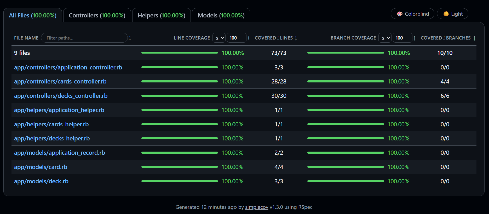

# Testing

StudyBuddy currently uses RSpec for its executable automated test suite. The tests are isolated with transactional fixtures and use the test database.

## Running tests

```bash
bundle exec rspec
```

RSpec starts SimpleCov through `spec/rails_helper.rb`. To run the suite and refresh the coverage report explicitly:

```bash
COVERAGE=true bundle exec rspec
```

The HTML report is generated at `coverage/index.html`. Running `bin/rails test` currently reports zero tests because the legacy Minitest controller and model files contain only commented examples; the two system-test examples are not part of that command's executable suite.

## Executed test cases with coverage

### Models: 14 examples

- `Card` accepts valid question, answer, and deck attributes.
- `Card` validates the presence of its question, answer, and deck.
- `Card` belongs to a deck.
- Cards can be edited and deleted.
- Deleting a card's deck removes the card.
- `Deck` accepts and persists a name and description.
- `Deck` has many cards and destroys associated cards when deleted.

### Requests: 41 examples

- Deck index, new, show, edit, update, create, and delete actions return the expected responses, render the expected content, and redirect correctly.
- Deck creation and update reject invalid names without changing persisted data.
- Deck deletion removes associated cards.
- Card index, new, show, edit, create, update, and delete actions work through nested deck routes.
- Cards are scoped to their selected deck, including empty-deck and cross-deck cases.
- Blank card questions and answers are rejected without creating or updating a card.
- Deck study navigation selects the first card by default, honors a selected card, and shows the correct previous/next controls.
- Invalid card IDs fall back to the first card, and empty decks show an empty-state message.
- Study sessions show only the selected deck's due cards (today or earlier), hide the answer until it is revealed, and show the number of cards due.
- Again, Hard, Good, and Easy ratings update the card through SM-2, remove it from the queue, and show the next due card or a "no cards due" message.
- Study sessions reject invalid ratings, cards that are not due, and cards from another deck without changing them.

### Routing: 7 examples

- Deck routes map GET index/new/show/edit, POST create, PATCH update, and DELETE destroy to the expected controller actions.

### Views: 11 examples

- Card index displays question and answer and links to the card show and new-card form.
- Card new and edit views render the form with the correct nested action and navigation link.
- Card show displays question and answer, edit and delete actions, and a link back to the card list.

## Latest test run

Command: `bundle exec rspec`

- 73 examples, 0 failures
- Line coverage: 73/73 (100%)
- Branch coverage: 10/10 (100%)
- Coverage report: `coverage/index.html`

The 80% coverage target is met. The run emits deprecation warnings for `SimpleCov.add_filter` and Rack's `:unprocessable_entity` status alias; these warnings do not affect the passing result.


