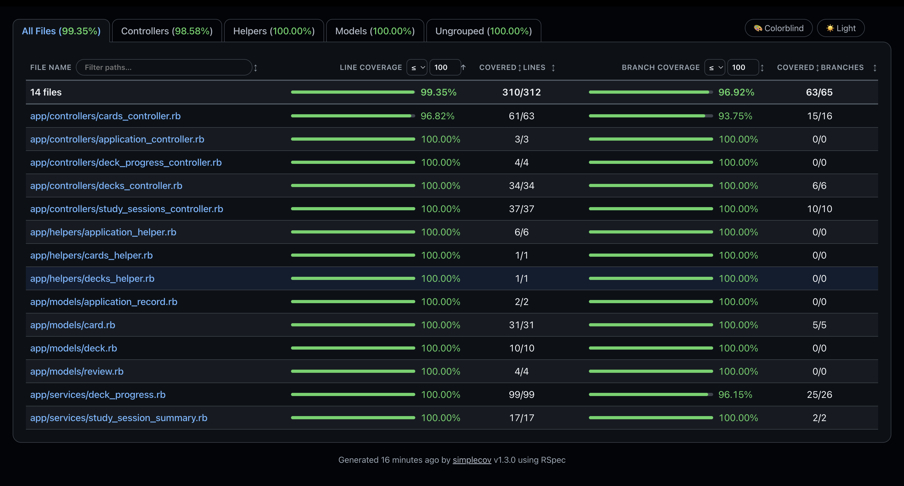

# Testing

StudyBuddy currently uses **RSpec** for its executable automated test suite. The tests cover models, request behavior, services, routing, and views. The test suite uses the test database and isolated test examples.

## Running Tests

```bash
bundle exec rspec
```

RSpec starts SimpleCov through `spec/rails_helper.rb`. To explicitly refresh the coverage report:

```bash
COVERAGE=true bundle exec rspec
```

The HTML coverage report is generated at:

```text
coverage/index.html
```
## Executed test cases with coverage



The legacy Minitest files are not part of the current executable RSpec suite.

### Models

* `Card` validates question, answer, and deck presence.
* Cards belong to decks and can be edited or deleted.
* Deleting a deck removes its associated cards.
* Cards initialize with the expected SM-2 values and review date.
* `Card#review` applies SM-2 scheduling for Again, Hard, Good, and Easy ratings.
* The ease factor never falls below 1.3.
* `Card#schedule` calculates the same SM-2 update as `review` without saving it.
* `Card.due` identifies cards due today or earlier, orders overdue cards first, and excludes future/reviewed cards.
* `Review` validates rating quality and review date and is removed when its card is deleted.
* Deck progress correctly handles due cards, review counts, and study streaks.

### Requests

* Deck CRUD actions return the expected responses, render the correct content, and redirect appropriately.
* Invalid and duplicate deck names are rejected without changing persisted data.
* Deck deletion removes associated cards.
* Nested card CRUD actions work correctly.
* Cards are scoped to their selected deck, including empty-deck and cross-deck cases.
* Blank card questions and answers are rejected.
* Card navigation handles first, selected, previous, next, invalid, and empty-deck cases.
* Study sessions display only due cards for the selected deck.
* Answers remain hidden until revealed.
* Again, Hard, Good, and Easy ratings update SM-2 scheduling and remove reviewed cards from the study queue.
* Invalid ratings, future cards, and cross-deck cards are rejected without modifying the card.
* Valid reviews are recorded, while rejected reviews are not.
* CSV export includes deck/card information and correctly handles commas, quotes, and newlines.
* CSV import accepts valid records, skips invalid records, preserves valid records during partial imports, and reports the number of skipped records.
* Deck pages display due cards, review counts, and study streaks.
* Progress pages display mastery, streaks, milestones, weekly activity, and appropriate empty states.
* Study session summaries report only reviews from the completed session.

### Services

* `DeckProgress` calculates due cards, reviews, streaks, mastery levels, and progress.
* `DeckProgress` handles active, at-risk, and inactive streaks.
* Streak milestones and earned badges are calculated correctly.
* Mastery progress handles New, Learning, and Mastered cards.
* Simulated mastery reviews do not persist changes.
* Weekly progress returns Monday-to-Sunday activity for the selected deck.
* `StudySessionSummary` counts session reviews, rating breakdowns, remembered percentage, and next review date.

### Routing

* Deck routes correctly map index, new, show, edit, create, update, and delete actions to the expected controller actions.

### Views

* Card index displays card questions and answers and provides navigation links.
* Card new and edit views render the correct nested forms.
* Card show displays question, answer, edit/delete actions, and navigation back to the card list.

## Latest Test Run

Command:

```bash
bundle exec rspec
```

**198 examples, 0 failures**

* **Line coverage:** 310 / 312 (**99.35%**)
* **Branch coverage:** 63 / 65 (**96.92%**)
* **Coverage report:** `coverage/index.html`

The project exceeds the **80% coverage target**.

The test run currently produces deprecation warnings for `SimpleCov.add_filter` and Rack's `:unprocessable_entity` status alias. These warnings do **not** affect the passing test result.